# SIDMA — Sistem Informasi Data Mahasiswa


## SELAMAT DATANG

Proyek UTS Mata Kuliah **Pemrograman Web Fullstack**

| Info | Detail |
|------|--------|
| **Nama** | Muhammad Hafidz Rifai |
| **NIM** | 2305101077 |
| **Kelas** | TIF - 6A |
| **Universitas** | Universitas PGRI Madiun |
| **Mata Kuliah** | Pemrograman Web Fullstack |

---

## Deskripsi

SIDMA adalah sistem informasi berbasis web untuk mengelola data mahasiswa
dan program studi. Dibangun menggunakan framework **Laravel 13** dengan
arsitektur **MVC (Model-View-Controller)** dan dilengkapi dengan **REST API**.

---

## Fitur

- **Dashboard Statistik** — Total mahasiswa, statistik per status & per program studi
- **CRUD Mahasiswa** — Tambah, lihat, edit, dan hapus data mahasiswa
- **CRUD Program Studi** — Kelola data program studi
- **Filter & Search** — Filter berdasarkan prodi & status, cari berdasarkan nama/NIM
- **Badge Status** — Tampilan badge warna untuk status mahasiswa (Aktif, Cuti, Lulus, Keluar)
- **Konfirmasi Hapus** — Dialog konfirmasi menggunakan SweetAlert2
- **Paginasi** — Navigasi halaman dengan Bootstrap 5
- **REST API** — Endpoint API untuk data mahasiswa

---

## Tech Stack

| Teknologi     | Versi | Keterangan         |
|---------------|-------|--------------------|
| PHP           | 8.3   | Backend language   |
| Laravel       | 13    | PHP Framework      |
| SQLite        | -     | Database           |
| Bootstrap     | 5.3   | CSS Framework (CDN)|
| Tailwind CSS  | v4    | Utility CSS        |
| Font Awesome  | 6.4   | Icon library (CDN) |
| SweetAlert2   | 11    | Alert library (CDN)|
| Vite          | 6     | Asset bundler      |

---

## Migrasi Database

Proyek ini menggunakan **Laravel Migration** untuk membuat dan mengelola struktur database secara terprogram. Semua file migrate tersimpan di folder `database/migrations/`.

### File-File Migration

| Nama File | Deskripsi |
|-----------|-----------|
| `2026_05_26_030208_create_program_studi_table.php` | Membuat tabel `program_studi` |
| `2026_05_26_030220_create_mahasiswa_table.php` | Membuat tabel `mahasiswa` |
| Migrate bawaan Laravel | Tabel users, cache, sessions, jobs, failed_jobs, dll |

### Cara Menjalankan Migration

**Jalankan semua migration & seeder:**

    php artisan migrate --seed

**Atau jalankan migration saja (tanpa seeder):**

    php artisan migrate

**Untuk membatalkan migration terakhir:**

    php artisan migrate:rollback

**Untuk membatalkan semua migration:**

    php artisan migrate:reset

**Untuk membatalkan semua dan menjalankan lagi:**

    php artisan migrate:refresh --seed

### Informasi Seeder

Proyek ini memiliki 2 seeder utama yang akan memasukkan data dummy ke database saat menjalankan `--seed`:

- **ProgramStudiSeeder** — Menambahkan 5 data program studi (Teknik Informatika, Sistem Informasi, Manajemen Informatika, PGSD, Manajemen)
- **MahasiswaSeeder** — Menambahkan 10 data mahasiswa dengan relasi ke program studi

---

## Struktur Database

### Tabel `program_studi`

| Kolom      | Tipe    | Keterangan              |
|------------|---------|-------------------------|
| id         | integer | Primary key             |
| nama       | string  | Nama program studi      |
| jenjang    | string  | S1 / D3 / D4            |
| fakultas   | string  | Nama fakultas           |
| timestamps | -       | created_at, updated_at  |

### Tabel `mahasiswa`

| Kolom            | Tipe    | Keterangan                      |
|------------------|---------|---------------------------------|
| id               | integer | Primary key                     |
| program_studi_id | integer | Foreign key → program_studi     |
| nama             | string  | Nama lengkap mahasiswa          |
| nim              | string  | NIM (unique)                    |
| email            | string  | Email (nullable, unique)        |
| no_hp            | string  | Nomor HP (nullable)             |
| angkatan         | integer | Tahun angkatan                  |
| status           | enum    | Aktif / Cuti / Lulus / Keluar   |
| alamat           | text    | Alamat lengkap                  |
| timestamps       | -       | created_at, updated_at          |

---

## REST API Endpoints

| Method | Endpoint              | Deskripsi                              |
|--------|-----------------------|----------------------------------------|
| GET    | `/api/mahasiswa`      | Ambil semua data mahasiswa             |
| GET    | `/api/mahasiswa/{id}` | Ambil data mahasiswa berdasarkan ID    |

### Contoh Response `/api/mahasiswa`

    {
      "data": [
        {
          "id": 1,
          "nama": "Muhammad Hafidz Rifai",
          "nim": "2305101077",
          "email": "hafidz@example.com",
          "no_hp": "081234567890",
          "angkatan": 2023,
          "status": "Aktif",
          "alamat": "Madiun, Jawa Timur",
          "program_studi": {
            "id": 1,
            "nama": "Teknik Informatika",
            "jenjang": "S1",
            "fakultas": "Fakultas Teknik"
          }
        }
      ]
    }

---

## Screenshot & Gambar

### Dashboard
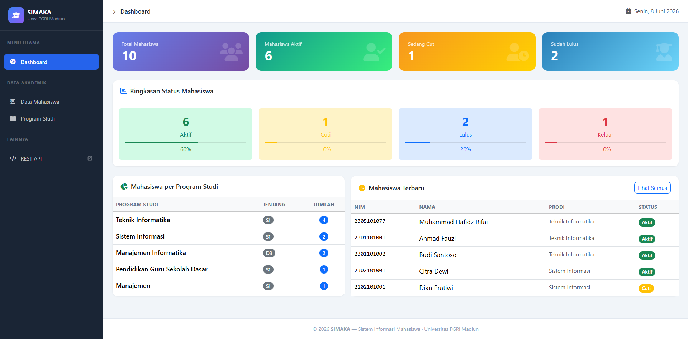

### Data Mahasiswa
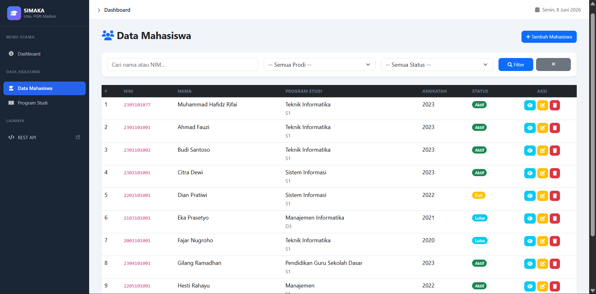

### Program Studi
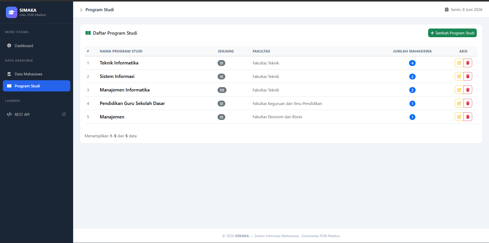

### Fitur Add Mahasiswa
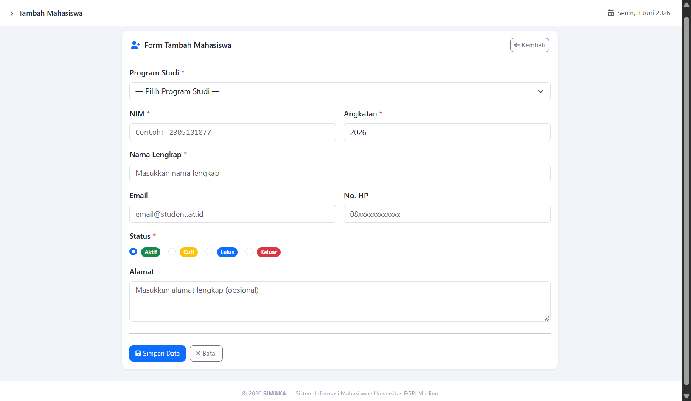

### Fitur Read Mahasiswa
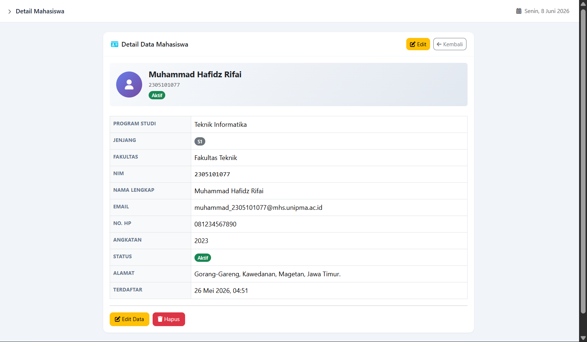

### Fitur Edit Mahasiswa
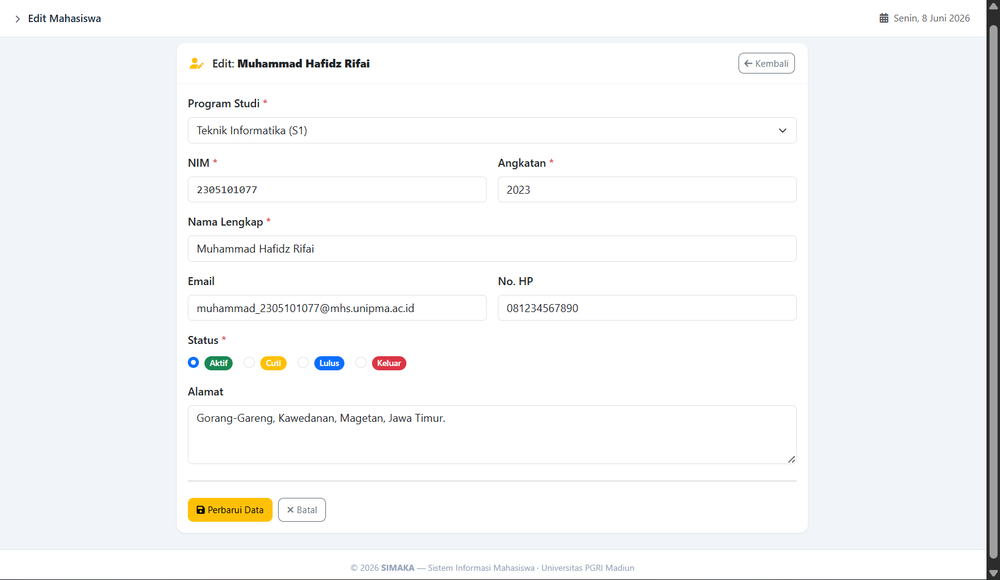

### Fitur Delete Mahasiswa
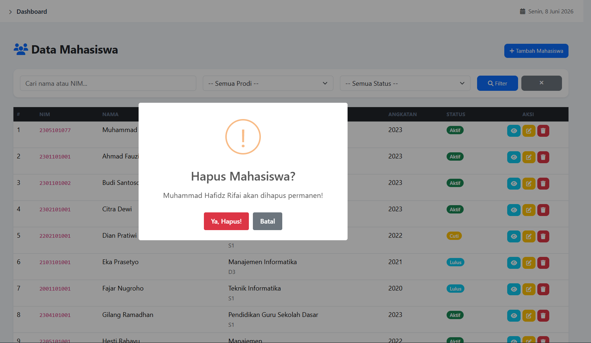

### Fitur Filter Mahasiswa
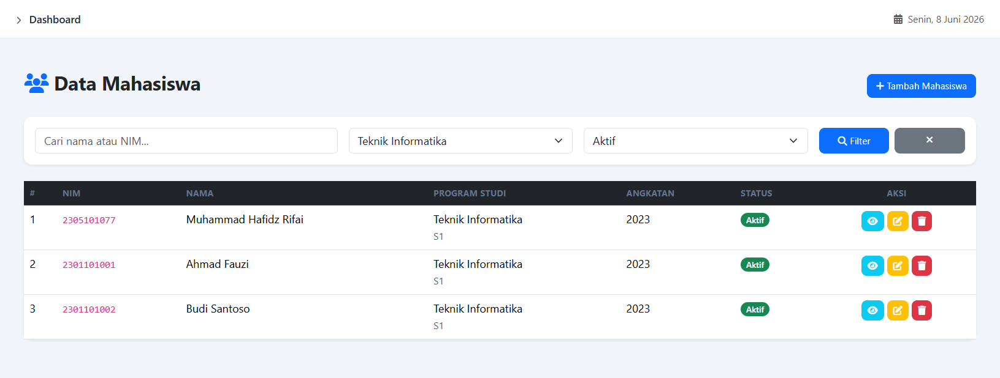

### Fitur Search Mahasiswa
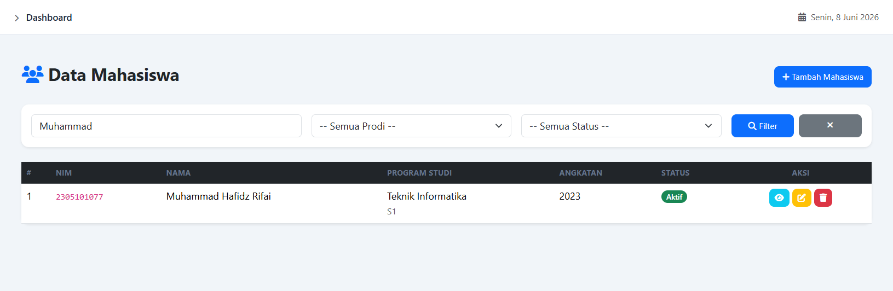 

### Fitur Add Prodi
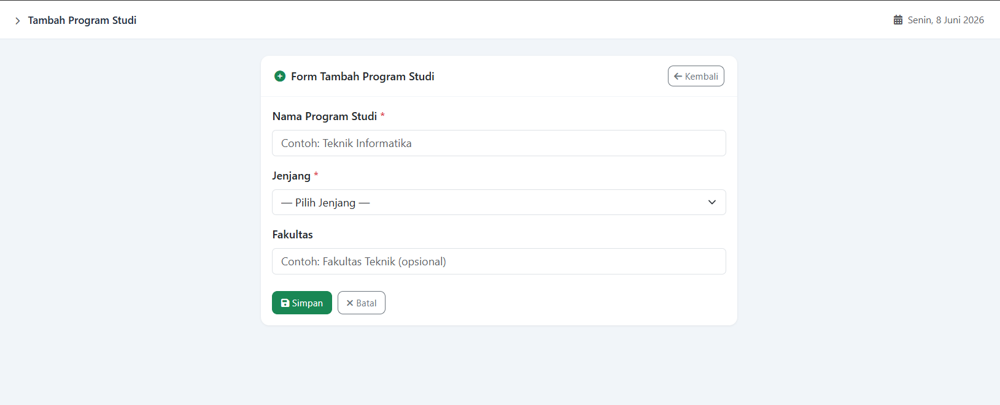

### Fitur Edit Prodi
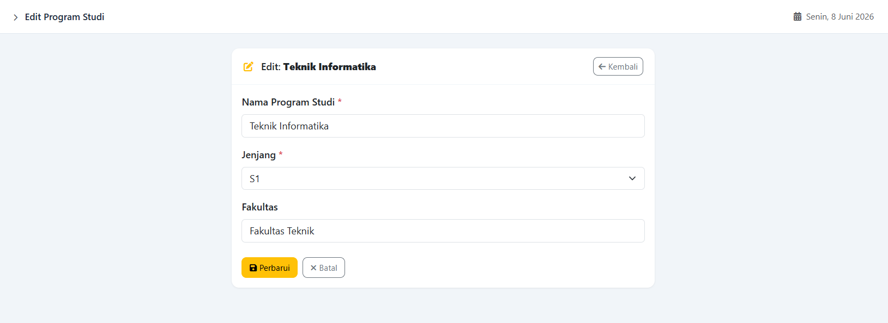

### Fitur Delete Prodi
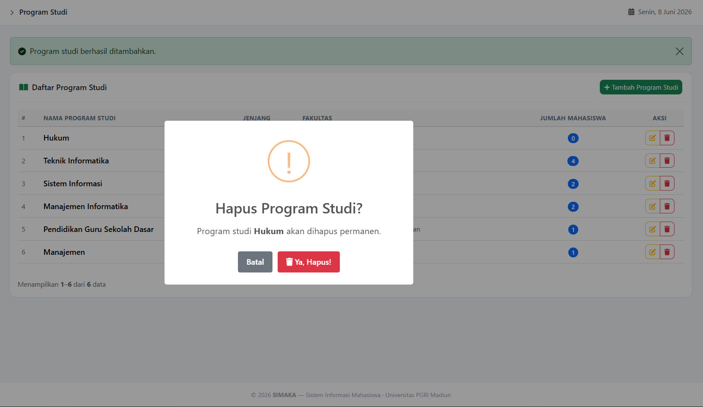

### Fitur Delete Prodi Gagal
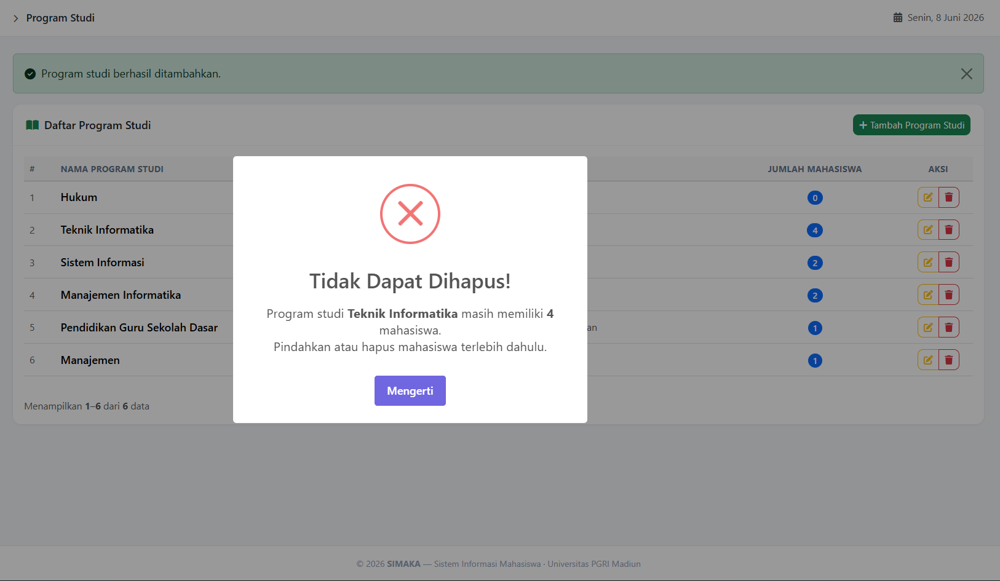

---

## Cara Instalasi & Menjalankan

### Prasyarat

Pastikan sudah terinstall:
- PHP >= 8.3
- Composer
- Node.js >= 18
- Git

### Langkah Instalasi

**1. Clone repository**

    git clone https://github.com/QUARK101/student-data-management.git
    cd student-data-management

**2. Install dependensi PHP**

    composer install

**3. Install dependensi Node.js**

    npm install

**4. Salin file environment**

    cp .env.example .env
    php artisan key:generate

**5. Jalankan migrasi & seeder**

    php artisan migrate --seed

**6. Build assets**

    npm run build

**7. Jalankan server**

    php artisan serve

**8. Buka di browser**

    http://localhost:8000

---

## Struktur Folder (MVC)

```
sistem-informasi-mahasiswa/
├── .editorconfig
├── .env
├── .env.example
├── .gitattributes
├── .gitignore
├── .npmrc
├── README.md
├── artisan
├── composer.json
├── composer.lock
├── package.json
├── package-lock.json
├── phpunit.xml
├── vite.config.js
│
├── app/
│   ├── Http/
│   │   ├── Controllers/
│   │   │   ├── Api/
│   │   │   │   └── MahasiswaApiController.php
│   │   │   ├── Controller.php
│   │   │   ├── DashboardController.php
│   │   │   ├── MahasiswaController.php
│   │   │   └── ProgramStudiController.php
│   │   └── Resources/
│   │       └── MahasiswaResource.php
│   ├── Models/
│   │   ├── Mahasiswa.php
│   │   ├── ProgramStudi.php
│   │   └── User.php
│   └── Providers/
│       └── AppServiceProvider.php
│
├── assets/
│   ├── Dashboard.png
│   ├── DataMahasiswa.png
│   ├── FiturAddMahasiswa.png
│   ├── FiturAddProdi.png
│   ├── FiturDeleteMahasiswa.png
│   ├── FiturDeleteProdi.png
│   ├── FiturDeleteProdiGagal.png
│   ├── FiturEditMahasiswa.png
│   ├── FiturEditProdi.png
│   ├── FiturFilterMahasiswa.png
│   ├── FiturReadMahasiswa.png
│   ├── FiturSearchMahasiswa.png
│   └── ProgramStudi.png
│
├── bootstrap/
│   ├── app.php
│   └── providers.php
│
├── config/
│   ├── app.php
│   ├── auth.php
│   ├── cache.php
│   ├── database.php
│   ├── filesystems.php
│   ├── logging.php
│   ├── mail.php
│   ├── queue.php
│   ├── services.php
│   └── session.php
│
├── database/
│   ├── .gitignore
│   ├── database.sqlite
│   ├── factories/
│   │   └── UserFactory.php
│   ├── migrations/
│   │   ├── 0001_01_01_000000_create_users_table.php
│   │   ├── 0001_01_01_000001_create_cache_table.php
│   │   ├── 0001_01_01_000002_create_jobs_table.php
│   │   ├── 2026_05_26_030208_create_program_studi_table.php
│   │   └── 2026_05_26_030220_create_mahasiswa_table.php
│   └── seeders/
│       ├── DatabaseSeeder.php
│       ├── MahasiswaSeeder.php
│       └── ProgramStudiSeeder.php
│
├── public/
│   ├── .htaccess
│   ├── favicon.ico
│   ├── index.php
│   ├── robots.txt
│   └── build/
│       ├── assets/
│       │   ├── app-BvRk9kiK.js
│       │   └── app-D1naa7x3.css
│       └── manifest.json
│
├── resources/
│   ├── css/
│   │   └── app.css
│   ├── js/
│   │   └── app.js
│   └── views/
│       ├── dashboard.blade.php
│       ├── index.blade.php
│       ├── welcome.blade.php
│       ├── layouts/
│       │   └── app.blade.php
│       ├── mahasiswa/
│       │   ├── create.blade.php
│       │   ├── edit.blade.php
│       │   ├── index.blade.php
│       │   └── show.blade.php
│       └── program_studi/
│           ├── create.blade.php
│           ├── edit.blade.php
│           └── index.blade.php
│
├── routes/
│   ├── api.php
│   ├── console.php
│   └── web.php
│
└── tests/
    ├── TestCase.php
    ├── Feature/
    │   └── ExampleTest.php
    └── Unit/
        └── ExampleTest.php
```

---

## Lisensi

Proyek ini dibuat untuk keperluan akademik — UTS Mata Kuliah Pemrograman
Web Fullstack, Universitas PGRI Madiun.

---

## Review & Rekomendasi Pengembangan

**REVIEW BY :**
* **NAMA** = MUHAMMAD HAFIZ FALAH
* **NIM** = 2305101120

Berikut adalah rekomendasi singkat langkah pengembangan proyek **SIDMA** ke depan:

1. **Keamanan & Autentikasi**
   * Tambahkan sistem login admin (menggunakan **Laravel Breeze**).
   * Batasi hak akses agar tidak semua orang bisa mengubah/menghapus data.

2. **Peningkatan Fitur**
   * **Upload Foto**: Tambahkan fitur unggah foto profil mahasiswa.
   * **Ekspor/Impor**: Fitur unduh data mahasiswa ke format Excel/PDF dan unggah data massal dari Excel.

3. **Optimasi Kode & API**
   * **Form Request**: Rapikan validasi input agar terpisah dari controller.
   * **API CRUD Lengkap**: Lengkapi endpoint API (tambah, edit, hapus) dan amankan menggunakan **Laravel Sanctum**.

4. **Kesiapan Produksi (Production)**
   * Ganti database SQLite ke **PostgreSQL** atau **MySQL** jika ingin digunakan secara nyata oleh banyak pengguna.
   * Tambahkan **Automated Testing** untuk memastikan fitur tidak rusak saat ada pembaruan kode.